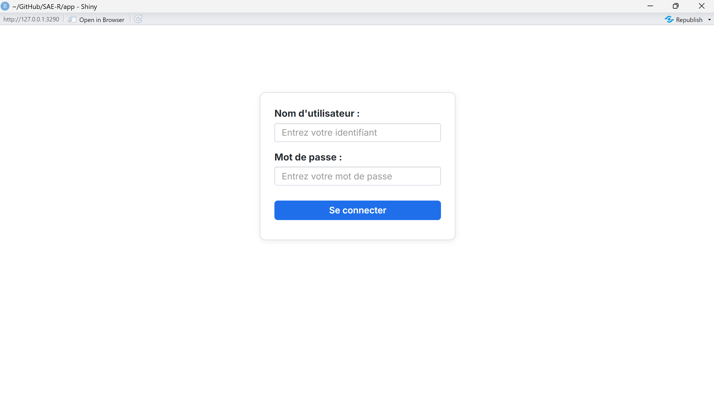
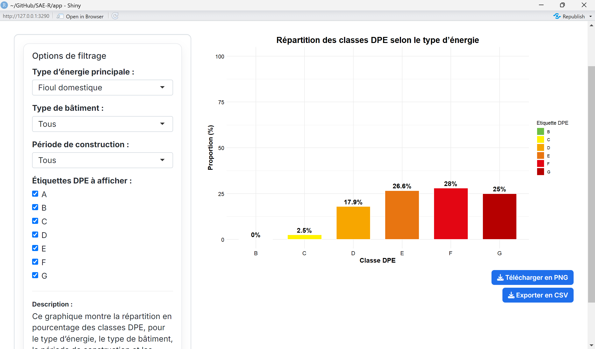
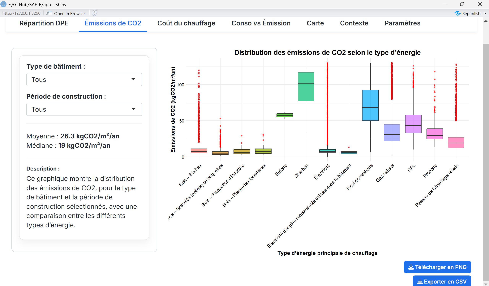
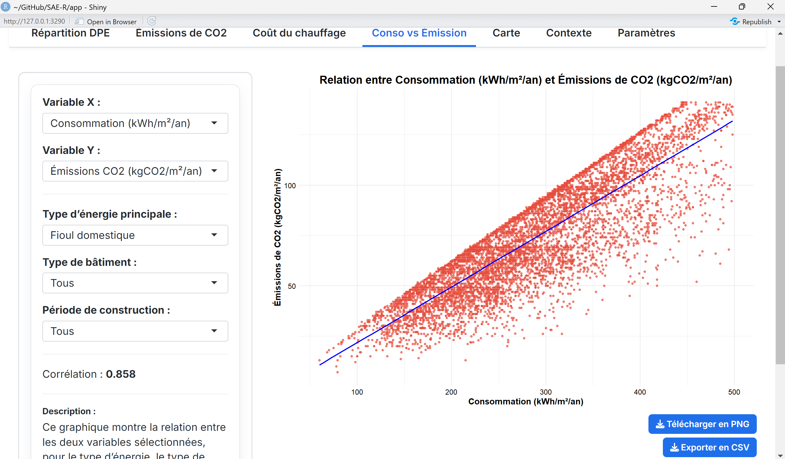
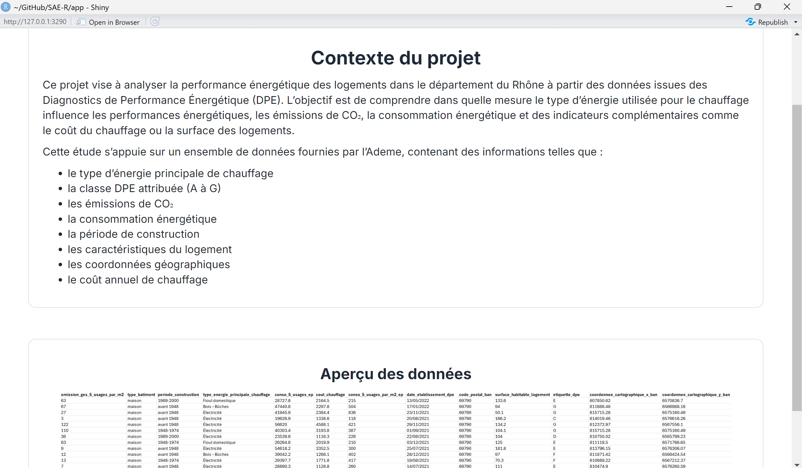
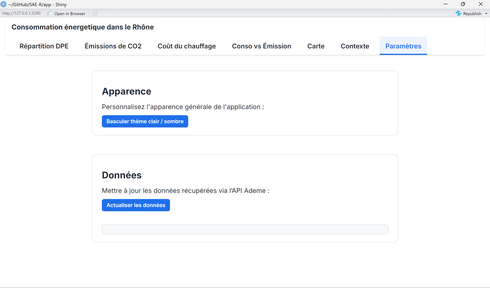

# Documentation Fonctionnelle

## 1. Présentation des pages de l'application

### 1.0. Page d'identification

Page d'accès sécurisée permettant à l'utilisateur de saisir un **nom
d'utilisateur** et un **mot de passe** et d'accéder à l'application
uniquement en cas d'identification correcte.

### 1.1. Répartition DPE

Page permettant de visualiser la répartition des classes DPE sous forme
de **barplot** via différents filtres. Il y a également un texte
descriptif et un bouton permettant de télécharger le graphique en PNG et
les données en CSV.

### 1.2. Émissions de CO2

Page dédiée à l'analyse des émissions de CO2 grâce à un **boxplot** des
émissions selon le type d'énergie via différents filtres. La moyenne et
la médiane y sont affichées et changent de manière dynamique. Il y a
également un texte descriptif et un bouton permettant de télécharger le
graphique en PNG et les données en CSV.

### 1.3. Coût du chauffage

Page montrant la distribution du coût annuel de chauffage via un
**histogramme** pouvant être filtré par type d'énergie, bâtiment,
période de construction, et la possibilité de fixer un plafond de coût
avec un slider. La moyenne et la médiane y sont affichées et changent de
manière dynamique. Il y a également un texte descriptif et un bouton
permettant de télécharger le graphique en PNG et les données en CSV.

### 1.4. Consommation vs Émissions

Page d'analyse croisée (**scatterplot**) entre deux variables au choix.
Il est possible de filtrer sur le type d'énergie, de bâtiment et la
période de construction. La droite de régression et l'indice de
corrélation y sont affichés et changent de manière dynamique. Il y a
également un texte descriptif et un bouton permettant de télécharger le
graphique en PNG et les données en CSV.

### 1.5. Carte

Page cartographique permettant de visualiser les logements du Rhône par
code postal sur une **carte**, et d'afficher la consommation
énergétique. Il est possible de n'afficher que le type d'énergie
souhaité, et de changer le code postal.

### 1.6. Contexte

Page statique présentant le **contexte** du projet DPE et ses objectifs,
en donnant la liste des principales variables utilisées dans notre site.
Un aperçu de ces données est disponible en bas de page.

### 1.7. Paramètres

Page de paramétrage pour à la fois changer le style de l'application et
actualiser les données. Il est possible de passer l'application en mode
nuit pour un meilleur confort visuel, et d'actualiser les données pour
avoir les dernières mises à jour via l'API ADEME.

------------------------------------------------------------------------

## 2. Fonctionnalités principales de l'application

-   Visualiser des statistiques énergétiques (DPE, CO₂, coût du
    chauffage, corrélations) via des graphiques interactifs.
-   Explorer les logements du Rhône sur une carte dynamique filtrable
    par énergie et code postal.
-   Télécharger les graphiques en PNG et les données filtrées en CSV.
-   Mettre à jour automatiquement le jeu de données grâce à l'API ADEME
    directement depuis l'application.
-   Changer de thème d'apparence d'application pour un meilleur confort
    visuel
