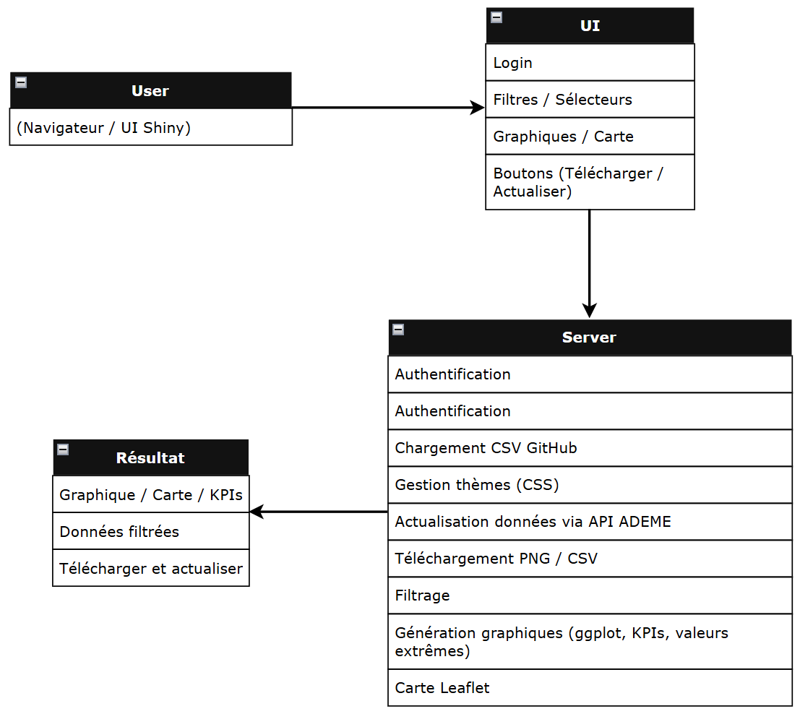
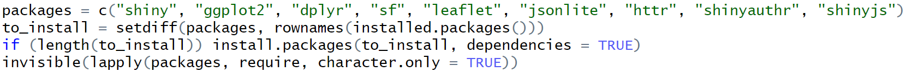

# Documentation Technique

## 1. Schéma de l'application

------------------------------------------------------------------------

## 2. Installation de l'application

### 2.1. Prérequis

Il est nécessaire pour installer l'application RShiny en local,
d'installer en premier lieu R et RStudio :

-   **R** : <https://cran.r-project.org/>
-   **RStudio** : <https://posit.co/download/rstudio-desktop/>

### 2.2. Recuperation du projet

Télécharger le dossier contenant :

-   le fichier **`app.R`**
-   le dossier **`www/`** (CSS, images, JavaScript)

Ces deux elements doivent etre dans le meme repertoire.

### 2.3. Installation des packages

L'application installe automatiquement les packages necessaires.\
Un bloc présent au début du code vérifie et installe les dépendances non
présente sur votre machine.

**-\> Aucune installation manuelle n'est requise.**

### 2.4. Lancement

1.  Ouvrir **`app.R`** dans RStudio
2.  Cliquer sur **Run App**
3.  L'application demarre automatiquement

------------------------------------------------------------------------

## 3. Présentation des packages utilises

**shiny -\>** Structure principale de l'application (UI, serveur,
réactivité, inputs/outputs).

**ggplot2 -\>**Création de tous les graphiques (barplot, boxplot,
histogramme, scatter).

**dplyr -\>** Manipulation et filtrage des données (selections,
conditions, regroupements).

**sf -\>** Conversion des coordonnées (Lambert 93 -\> WGS84) pour
l'affichage sur la carte.

**leaflet -\>** Affichage de la carte interactive : points, clusters,
légende, tuiles.

**jsonlite -\>** Décodage des réponses JSON provenant de l'API ADEME.

**httr -\>** Requêtes HTTP vers l'API ADEME (GET, encodage des URLs,
paramètres).

**shinyauthr -\>** Utilise pour la structure du login (initialisation de
l'authentification).

**shinyjs -\>** Interactions JavaScript : masquage/affichage d'éléments,
changement de thême, messages dynamiques.
